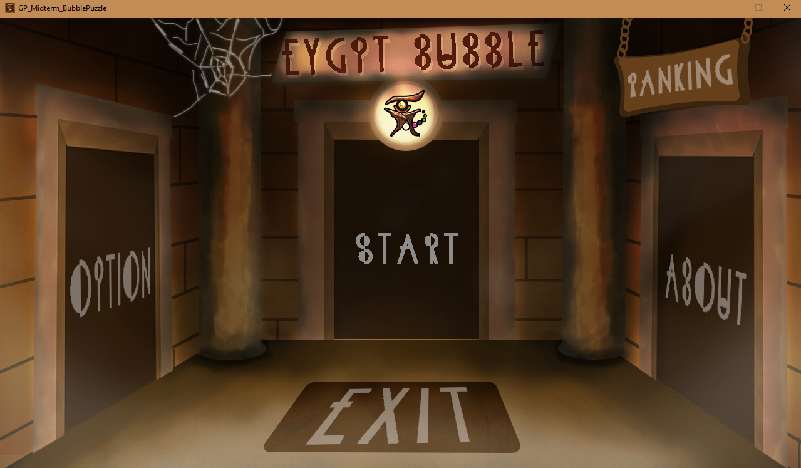
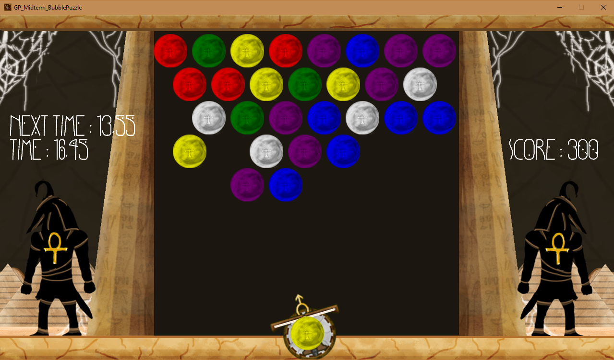

# Egypt Bubble

Bubble Puzzle game with basic logic by monogame.

## Installation

***Windows***:

> Check installer windows version (Win10 DX support) in __releases__ page.

## Screen Shot

## Release History
* 1.0.0
    * First release game version.
    * Have little bugs.

## Meta

My name is [@PePoDev](https://fb.com/pepo.dev) – support@pepo.dev

## Contributing

1. Fork it (<https://github.com/PePoDev/EgyptBubble/fork>)
2. Create your feature branch (`git checkout -b feature/fooBar`)
3. Commit your changes (`git commit -am 'Add some fooBar'`)
4. Push to the branch (`git push origin feature/fooBar`)
5. Create a new Pull Request
